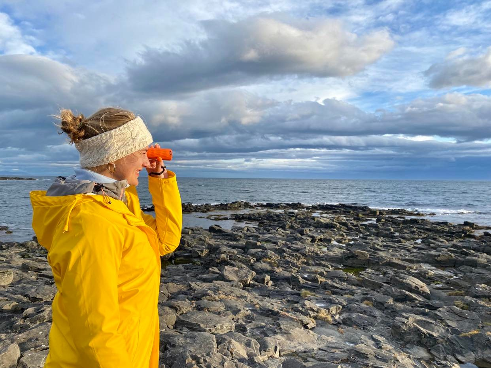

# McOwska.github.io

Hi, welcome to my first github page. My name is Zuza. Currently I'm studing IT on AGH in Cracow. My free time (if only i have any, thanks extented math classes 😜) I spend mosty at the stable 🏇 or sitting at the piano 🎹 

My plan B, if AGH gets too much for me, is to move far away and become a fisherwoman 😉 

# Kulawy Kustosz
Projekt Kulawy Kustosz tworzyliśmy w ramach zaliczenia przedmiotu Narzędzia Informatyczne. Głównym celem projektu było napisanie prostej gry - popularnego Snake'a, za pomocą takich technologii jak HTML, JS, CSS. Podczas projektu ważną rolę odgrywało także poznawanie różnych narzędzi do pracy grupowej jak np. GitHub, Slack, Google Drive itp.

Efekt finalny naszej gry:

Twórcy projektu Kulawy Kustosz:

Weronika Hilaszek:
https://werkah.github.io/

Zuzanna Makowska:
https://mcowska.github.io/

Mateusz Mirecki:
https://mateuszmirecki.github.io./

Wiktor Prosowicz:
https://leszywkniei.github.io/

Karolina Surówka:
https://ksuroweczka.github.io/

Łukasz Zawadzki:
https://lukzawadzki.github.io/

